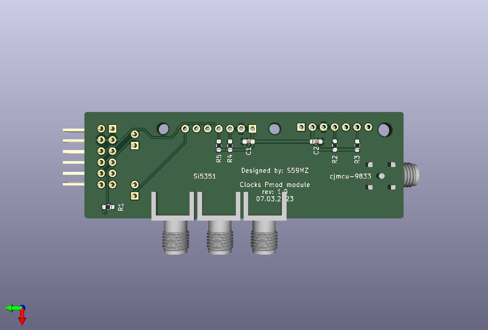

# clocks_pmod
PMOD PCB module for 7-Segment Display 

Schematic:
[clocks_pmod.pdf](clocks_pmod.pdf)

BOM:
[clocks_pmod.csv](clocks_pmod.csv)

Gerbers:
[gerbers.zip](https://github.com/s59mz/clocks_pmod/raw/main/gerbers.zip)
